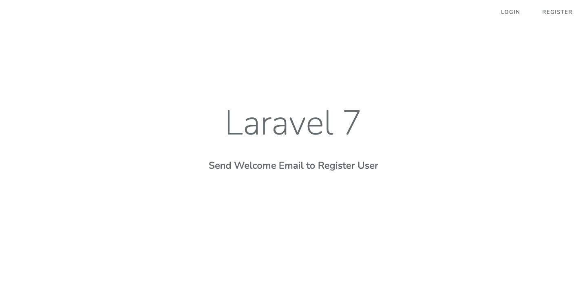
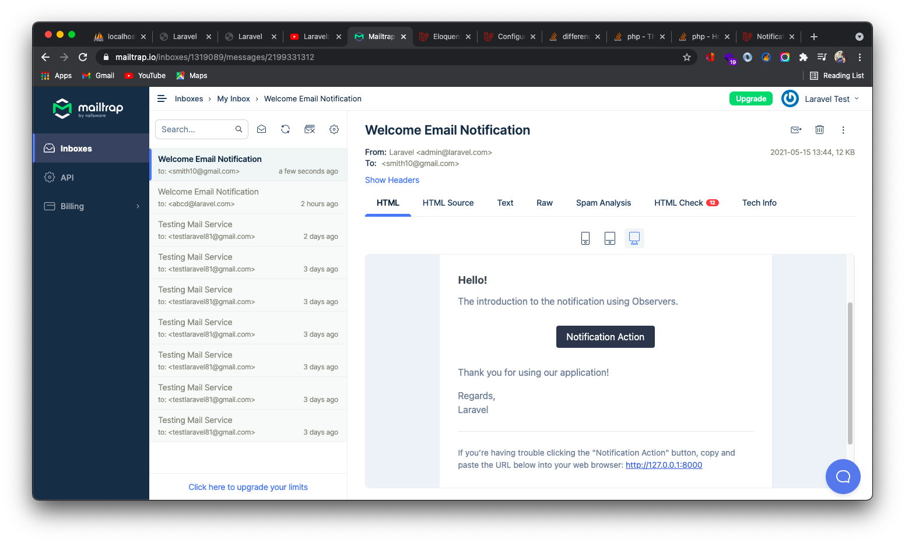
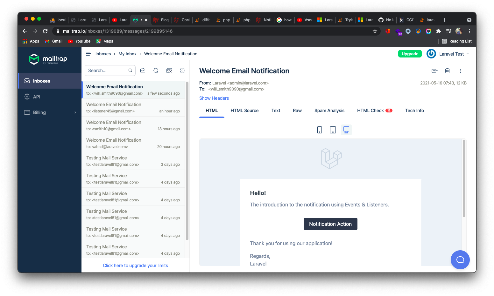

# SendMail-to-RegisterUser-Laravel7
Send mail to register user in 3 different ways.  
a)Register Controller  
b)Observer   
c)Event &amp; Listeners  

--------------------------------------------------------------------------------------------------------------------------------------------
### 1. Home Page

### 2. Sending Mail Using Observer

### 3. Sending Mail Using Event & Listeners

